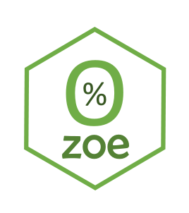

<!-- README.md is generated from README.Rmd. Please edit that file -->

```{r setup, include = FALSE}
knitr::opts_chunk$set(
  collapse = TRUE,
  comment = "#>",
  fig.path = "man/figures/README-",
  out.width = "100%"
)
```
# polite 

The goal of `zoe` is to provide data about new and used car registratons and in particular about the rise of zero-emission vehicles in Norway. Norway went from diesel-dominated car fleet to primarily hybrid and zero-emission cars in the course of last decade. Understanding of market dynamics, influence of competition, government policy and consumer preferences could be facilitated through data analysis of the datasets included in this package. 

## Installation

You can install the  development version of `zoe` from [GitHub](https://github.com/) with:

``` r
# install.packages("devtools")
devtools::install_github("dmi3kno/zoe")
```
## Datasets

In this version of the package two datasets are included. `bilsalget` ("car sales" in Norwegian) contains information about monthly new vehicle registrations. 

```{r}
library(zoe)
bilsalget_raw
```

Raw version of the dataset is provided in the "long" format. The dataset contains 3 time series (models, makes and monthly totals) from different sources (tables and images published on www.ofvas.no)


Zero-emission vehicles are described in `zoe` dataset. This data contains monthly totals of new car registrations, used car import, share of diesel vehicles, average co2 emission of new vehicles, number of hybrids and zero-emission vehicles registred in the country.

```{r}
library(zoe)
zoe_raw
```

Raw version of the dataset is provided in the "wide" format. The dataset contains several time series recorded primarily from analysis commentaries on www.ofvas.no website. Original text of commentaries is also provided (in Norwegian).

## Example

We can produce insightful visualizations even from the raw dataset

```{r, fig.width=7, fig.height=5, dpi=300, out.width = '90%', message=FALSE, warning=FALSE}
library(zoe)
library(tidyverse)
library(lubridate)
library(hrbrthemes)

zoe_raw %>% filter(year>=2010) %>% 
  mutate(date=ymd(paste(year, month, "01", sep="-")),
         diesel=diesel_share/100*(total+import_used),
         zoe=total_zoe+import_used_zoe,
         hybrid=total_hybrid,
         gasoline=total+import_used-diesel-zoe-hybrid) %>% 
  select(date, gasoline, diesel, zoe, hybrid) %>% 
  gather(key, value, -date) %>% 
  ggplot()+
  geom_line(aes(x=date, y=value, color=key, group=key), size=1.1)+
  theme_ipsum_rc()+
  scale_colour_ipsum()+
  labs(title="Car registrations in Norway by fuel",
       subtitle="Over the last decade Norway went from black to green",
       y="Vehicle registrations", x=NULL, color="Fuel type")
```

